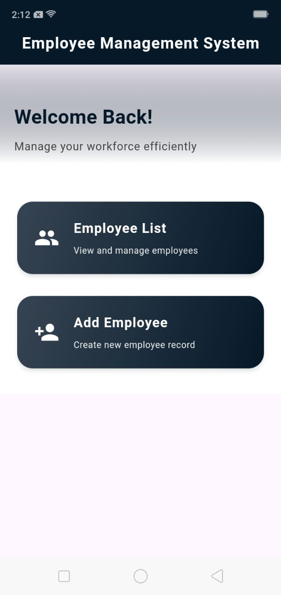
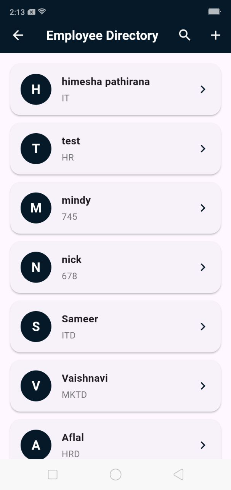

# Employee Management System

This is a Flutter-based employee management system that allows users to manage employee data. The application provides functionalities such as adding, editing, deleting, searching, and displaying a list of employees.

## Features

- Add a new employee
- Edit existing employee details
- Delete an employee
- Search and display employee details
- View a list of existing employees

## Functionality Overview

The app offers a simple and intuitive user interface to manage employees. Below are the core functionalities:

1. **Add Employee**: Add new employee details to the system.
2. **Edit Employee**: Modify the details of an existing employee.
3. **Delete Employee**: Remove an employee from the system.
4. **Search Employee**: Search for employees based on various details.
5. **Employee List**: View a list of all existing employees.

## Error Handling and User Feedback

Basic error handling is implemented to provide clear feedback to users during actions like adding, editing, or deleting employees. Users are informed about successful actions or any errors encountered.

## Design

The app is designed to be responsive and user-friendly, with a clean interface and optimized for mobile devices.

## Screenshots

Here are some screenshots of the app:

<p align="center">
 
 
 
 
 
 
 
 
  
  
  
</p>


## Getting Started

To get started with this project, follow the steps below.

### Prerequisites

- Install Flutter on your system by following the instructions on the [Flutter installation page](https://flutter.dev/docs/get-started/install).

### Installation

1. Clone this repository to your local machine:

    ```bash
    git clone <repository_url>
    ```

2. Navigate to the project directory:

    ```bash
    cd empsystem
    ```

3. Install the necessary dependencies:

    ```bash
    flutter pub get
    ```

4. Run the application:

    ```bash
    flutter run
    ```

## Resources

A few resources to get you started if this is your first Flutter project:

- [Flutter Documentation](https://docs.flutter.dev/)
- [Flutter YouTube Channel](https://www.youtube.com/c/FlutterDev)
- [Postman](https://www.postman.com/): Tool for API testing.
- [Swagger](https://swagger.io/): Tool for designing, building, and documenting APIs.

For help getting started with Flutter development, view the [online documentation](https://docs.flutter.dev/), which offers tutorials, samples, guidance on mobile development, and a full API reference.
